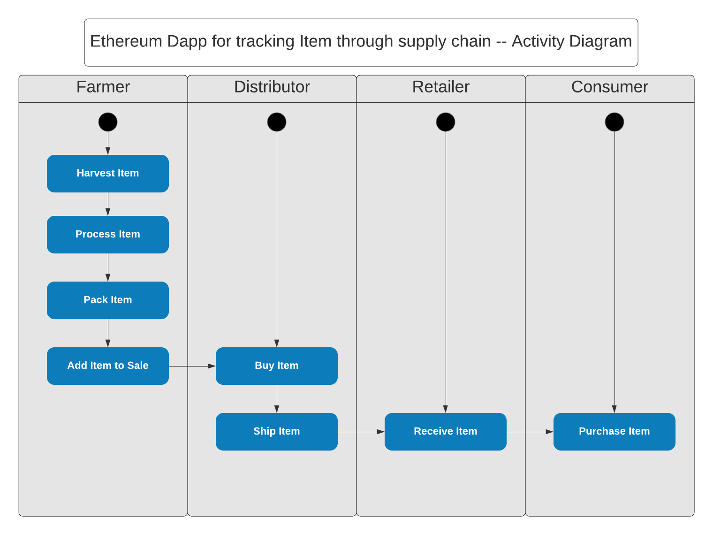
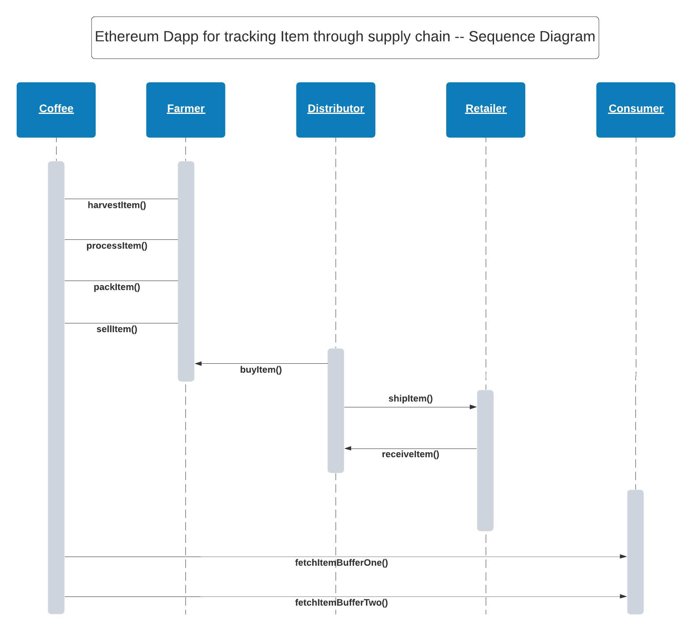
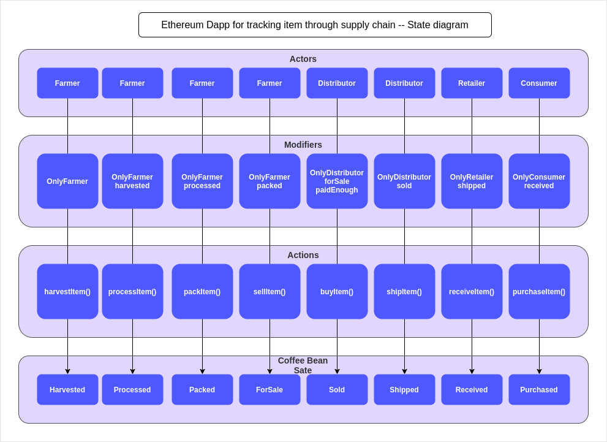
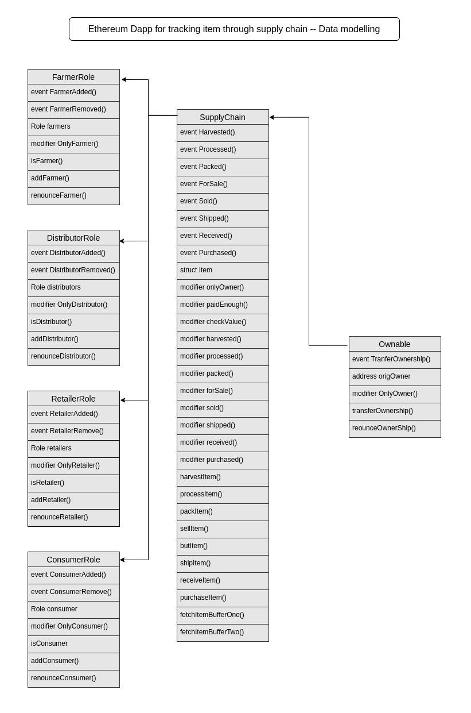

# Supply chain
This repository containts an Ethereum DApp that demonstrates a Supply Chain flow between a Seller and Buyer. The user story is similar to any commonly used supply chain process. A Seller can add items to the inventory system stored in the blockchain. A Buyer can purchase such items from the inventory system. Additionally a Seller can mark an item as Shipped, and similarly a Buyer can mark an item as Received.

### UML diagrams
 <br>
 <br>
 <br>
 <br>

### Libraries
**Truffle**: Used for developing, testing, and deploying my smart contracts

### Deploy smart contracts on a public test network (Rinkeby)
| Contract Name | Contract Address|
|:--------------|:----------------|
|FarmerRole|0x91e8dcfB2d1a4Fca16796Ef33bC503Af6d3b4e67|
|DistributorRole|0xD7f1e9a5D2300319a1905adc2AC953be7Cec7376|
|RetailerRole|0x16ad6aED92D0b0a8ba5129924E5E082c5c8fbC03|
|ConsumerRole|0x730F03a7b97C0397d0a469eBb6D8EeF30dddd652
|SupplyChain|0x6210ad6c20a1F5D28F556A23B7e48C0B557bD354|

### Installing
Please make sure you've already installed ganache-cli, Truffle and enabled MetaMask extension in your browser.

```
cd project
npm install
truffle compile
truffle migrate
truffle test
npm run dev
```

### Acknowledgments
* Solidity
* Ganache-cli
* Truffle